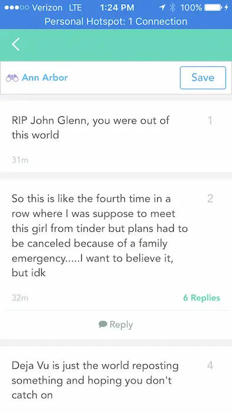

<h1 class="r-fit-text">Applications of Geospatial Data in  Digital Communication</h1>

William Svoboda '22

Adviser: Michael Freedman

---

## Motivation

<ul>
    <li class="fragment">Digital communication is important</li>
    <ul>
        <li class="fragment">Over <u>4.5 billion</u> social media users worldwide</li>
    </ul>
</ul>

---

## What's the problem?

<ul>
    <li class="fragment">We live in the real world!</li>
    <li class="fragment">Even though 99% of social media is through mobile devices&hellip;</li>
    <li class="fragment">Digital communication mostly independent of the physical space around us</li>
</ul>

---

<!-- .slide: data-auto-animate -->

## My hypothesis?

---

<!-- .slide: data-auto-animate -->

## My hypothesis?

_Tying digital interaction to physical proximity increases user engagement_

---

<!-- .slide: data-auto-animate -->

## My hypothesis?

_Tying digital interaction to physical proximity increases user engagement_

## The goal?

---

<!-- .slide: data-auto-animate -->

## My hypothesis?

_Tying digital interaction to physical proximity increases user engagement_

## The goal?

_A social app that gates messaging to proximity_

---

## Background and related work

---

## Geospatial data

<ul>
    <li class="fragment">Data related to a specific geographic position</li>
    <li class="fragment">Combines location, attribute, and temporal information</li>
</ul>

---

## In social media

    
    
    

---

## Approach

---

## Key features

<ol>
    <li class="fragment">Main screen showing the user’s location and surrounding area</li>
    <li class="fragment">Ability to leave ephemeral messages at one’s location, visibly indicated to all users</li>
    <li class="fragment">Messages can only be read near coordinates where they were posted</li>
</ol>

---

<!-- .slide: data-auto-animate -->

## Why?

---

<!-- .slide: data-auto-animate -->

## Why?

_Messages both spatially and temporally relevant!_

---

<!-- .slide: data-auto-animate -->

## Why?

_Messages both spatially and temporally relevant!_

_Access directly gated by physical proximity_

---

## Implementation

---

## Project architecture

<ul>
    <li class="fragment">Client-server model, client is iPhone app</li>
    <ul>
        <li class="fragment">Access to Apple's <code>MapKit</code> and <code>SwiftUI</code> frameworks</li>
    </ul>
    <li class="fragment">Client handles all user-facing tasks</li>
    <li class="fragment">Server handles content, authentication, geospatial queries, and other centralized functionality</li>
</ul>

---

<!-- .slide: data-auto-animate -->

## From design&hellip;

---

<!-- .slide: data-auto-animate -->

## &hellip;to implementation

---

## Client details

<ul>
    <li class="fragment"><code>SwiftUI</code> is a declarative framework</li>
    <ul>
        <li class="fragment">Describe interface you want, layout engine handles the details!</li>
        <li class="fragment">Separates presentation from business logic</li>
    </ul>
    <li class="fragment">Good fit for MVVM (Model–view–viewmodel) design pattern</li>
</ul>

---

## Shared services

- Wrote _managers_ to represent a shared service layer, injected at startup:

<pre><code data-line-numbers="*|6-9|10-15|17-25">
import SwiftUI

@main
struct Geo: App {

    let settingsManager: SettingsManager
    let authenticationManager: AuthenticationManager
    let locationManager: LocationManager

    init() {
        self.settingsManager = SettingsManager()
        self.authenticationManager = AuthenticationManager(settingsManager: settingsManager)
        self.locationManager = LocationManager(settingsManager: settingsManager)
    }

    // Inject required services after initializing the app
    var body: some Scene {
        WindowGroup {
            ContentView()
                .environmentObject(settingsManager)
                .environmentObject(authenticationManager)
                .environmentObject(locationManager)
        }
    }
}
</code></pre>

---

## Server details

<ul>
    <li class="fragment">Containerized application using Docker</li>
    <li class="fragment">Redis as database</li>
    <ul>
        <li class="fragment">Fast ($\mathcal{O}(N+\log{M})$) and straightforward geospatial queries</li>
    </ul>
    <li class="fragment"><code>FastAPI</code> as webserver</li>
    <ul>
        <li class="fragment">Entire server is $< 200$ LOC</li>
    </ul>
</ul>

---

## Demonstration

<iframe class="r-stretch" data-src="https://www.youtube.com/embed/41pThFWO-SE" data-autoplay></iframe>

---

## Evaluation

---

## Testing logistics

<ul>
    <li class="fragment">Deployed server on DigitalOcean Droplet</li>
    <li class="fragment">Distributed app using Apple's TestFlight service</li>
    <li class="fragment">Solicited testers on different Princeton listservs</li>
</ul>

---

<!-- .slide: data-auto-animate -->

## How to test?

---

<!-- .slide: data-auto-animate -->

## How to test?

- Evaluate off qualitative feedback
- Ask questions to confirm/reject initial hypothesis.

---

<!-- .slide: data-auto-animate -->

## Results

<ul>
    <li class="fragment">19 unique users</li>
    <ul>
        <li class="fragment">15 opened app at least once</li>
        <li class="fragment">Average of 8.4 sessions/user</li>
        <li class="fragment">Average rating of 7/10 on overall UX</li>
    </ul>
    <li class="fragment">Positive feedback overall</li>
    <ul>
        <li class="fragment">Comparisons to geocaching, Pokémon GO</li>
        <li class="fragment">Majority agreed with hypothesis</li>
        <li class="fragment">83.3% believed primary purpose would be for status updates</li>
    </ul>
</ul>

---

## Negatives

<ul>
    <li class="fragment">No tutorial, onboarding flow</li>
    <ul>
        <li class="fragment">Unclear on interaction radius, message expiration</li>
    </ul>
    <li class="fragment">Inability to respond to messages</li>
    <li class="fragment">Low user population &rarr; lack of community</li>
</ul>

---

<!-- .slide: data-auto-animate -->

## Was it a success?

---

<!-- .slide: data-auto-animate -->

## Was it a success?

<h1 class="r-fit-text">YES!</h1>

---

## Conclusions

<ul>
    <li class="fragment">Intersection of geospatial data and digital communication is relatively unexplored</li>
    <li class="fragment">Geospatial data can connect people</li>
    <li class="fragment">Future work?</li>
</ul>

---

## Code availability

    <ul>
        <li>Client: <a href="https://github.com/thisstillwill/Geo-Client">https://github.com/thisstillwill/Geo-Client</a></li>
        <li>Server: <a href="https://github.com/thisstillwill/Geo-Server">https://github.com/thisstillwill/Geo-Server</a></li>
        <li>Report: <a href="https://github.com/thisstillwill/Geo-Thesis">https://github.com/thisstillwill/Geo-Thesis</a></li>
    </ul>

---

<h2 class="r-fit-text">Thank you!</h2>
